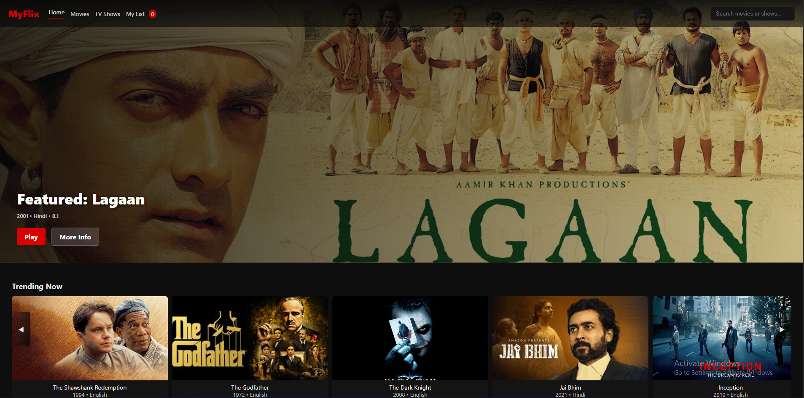

# MyFlix - Netflix-style Movies & TV Shows Demo

A responsive **Netflix-style web demo** showcasing movies and TV shows with a featured hero section, horizontal scrollable rows, search functionality, and a modal for detailed info. Built using **HTML, CSS, and JavaScript**.

---

## Features

- **Hero Section**
  - Displays a featured movie.
  - `Play` button triggers a demo overlay showing "Playing..." effect.
  - `More Info` button opens a modal with detailed info about the featured movie.

- **Movie & TV Show Cards**
  - Cards display the poster, title, year, and language.
  - Titles appear **below the image** for clarity.
  - Hover effects with scale-up animation and shadow.
  - Click on card opens modal with more information.

- **Modal Details**
  - Shows image, title, year, language, rating, description.
  - For TV Shows, displays list of episodes with buttons to view episode details.
  - “Add to My List” button to toggle items in My List.

- **My List**
  - Persistent list saved in **localStorage**.
  - Badge in navbar shows number of items.
  - Separate tab displays all added items.

- **Search Functionality**
  - Live filtering of visible cards based on title.

- **Horizontal Scroll**
  - Each section row scrolls horizontally.
  - Arrows provided to navigate left/right.

- **Responsive Design**
  - Works well on mobile, tablet, and desktop.
  - Adjusts card sizes, hero section, and modal layout.

---

## Technologies Used

- **HTML5**  
- **CSS3** (with Flexbox, Grid, and responsive media queries)  
- **JavaScript** (Vanilla JS, DOM manipulation, localStorage)

---

## Project Structure

myflix/
│
├─ index.html # Main HTML file
├─ style.css # All CSS styling
├─ script.js # JavaScript for rendering, modal, search, My List
├─ image/ # Movie & TV show poster images
└─ README.md # Project documentation

---

## How to Run

1. **Clone or download** the repository.
2. Open `index.html` in a **modern web browser** (Chrome, Firefox, Edge).
3. Interact with:
   - Hero section buttons (`Play` / `More Info`)
   - Movie/TV show cards
   - Horizontal scroll arrows
   - Search bar
   - My List tab

---

## Usage Instructions

- **Play Button:** Shows a demo overlay "Playing..." for featured movie.  
- **More Info Button:** Opens modal with detailed info.  
- **Card Click:** Opens modal with movie/TV show details.  
- **TV Shows:** Episodes listed in modal; click episode to view description.  
- **Add to My List:** Adds/removes item; count updates in navbar.  
- **Search:** Type in the search bar to filter cards by title.  
- **Responsive:** Works well across devices and screen sizes.

---

## Notes

- All images are placeholders; you can replace them in the `image/` folder.  
- LocalStorage is used to save `My List` across page reloads.  
- This is a **demo site**; no backend or actual video playback implemented.

---

## Demo Screenshot

  
*(Replace with your own screenshots as needed)*

---

## Live Demo

Try MyFlix online: [Click here to view demo](https://<username>.github.io/MyFlix/)

## License

This project is **for educational/demo purposes**. You may modify and use it freely.
